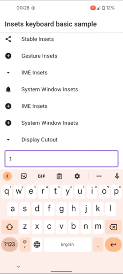

# Insets Examples

Repository with insets samples for compose and standard views. 

## Compose

Implementation based on compose version *1.2.0-alpha06* with a partially usage of Accompanist library 

Currently available samples:

1. Basic edge-to-edge list 

   

2. Basic IME insets

   

3. IME insets with scroll gestures

   

4. Fullscreen immersive with display cutout

   

5. Fullscreen immersive with stable insets for TopBar

   

6. Mandatory gesture bottom insets

   

7. Exclusion gesture insets for horizontal list

   

